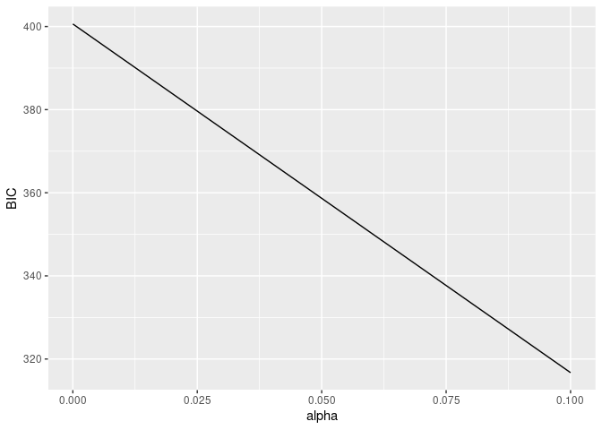
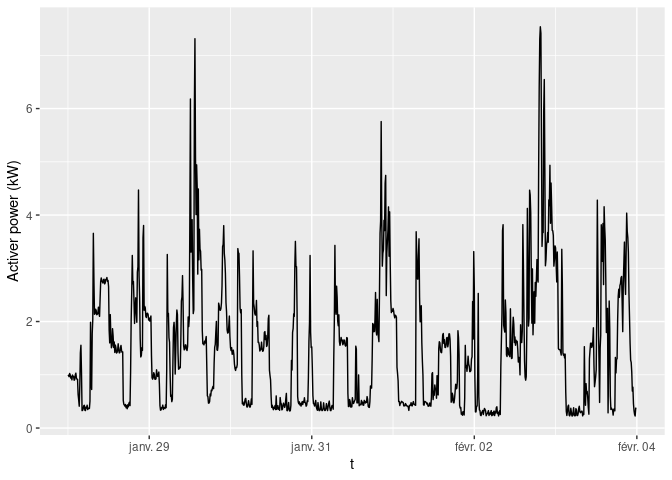
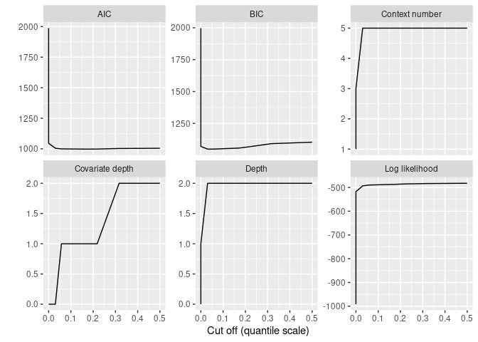
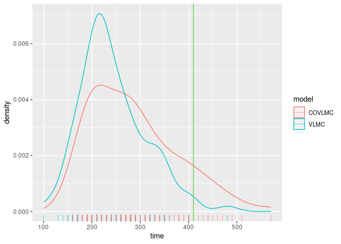
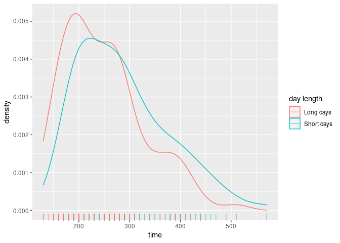

<!-- README.md is generated from README.Rmd. Please edit that file -->

# Variable Length Markov Chains with Covariates

<!-- badges: start -->

[](https://github.com/fabrice-rossi/mixvlmc/actions/workflows/R-CMD-check.yaml)

<!-- badges: end -->

`mixvlmc` implements variable length Markov chains (VLMC) and variable
length Markov chains with covariates (COVLMC), as described in:

- [Bühlmann, P. and Wyner, A. J. (1999), Variable length Markov chains.
  Ann. Statist. 27 (2)
  480-513](https://dx.doi.org/10.1214/aos/1018031204)
- [Zanin Zambom, A., Kim, S. and Lopes Garcia, N. (2022), Variable
  length Markov chain with exogenous covariates. J. Time Ser. Anal.,
  43 (2) 312-328](https://doi.org/10.1111/jtsa.12615)

`mixvlmc` includes functionalities similar to the ones available in
[VLMC](https://cran.r-project.org/package=VLMC) and
[PST](https://cran.r-project.org/package=PST). The main advantages of
`mixvlmc` are the support of time varying covariates with COVLMC and the
introduction of post-pruning of the models that enables fast model
selection via information criteria.

## Installation

The package can be installed from CRAN with:

``` r
install.packages("mixvlmc")
```

The development version is available from GitHub:

``` r
# install.packages("devtools")
devtools::install_github("fabrice-rossi/mixvlmc")
```

## Usage

### Variable length Markov chains

Variable length Markov chains (VLMC) are sparse high order Markov
chains. They can be used to model time series (sequences) with discrete
values (states) with a mix of small order dependencies for certain
states and higher order dependencies for other states. For instance,
with a binary time series, the probability of observing 1 at time $t$
could be constant whatever the older past states if the last one (at
time $t-1$) was 1, but could depend on states at time $t-3$ and $t-2$ if
the state was 0 at time $t-1$. A collection of past states that
determines completely the transition probabilities is a *context* of the
VLMC. Read `vignette("context-trees")` for details about contexts and
context tree, and see `vignette("variable-length-markov-chains")` for a
more detailed introduction to VLMC.

VLMC with covariates (COVLMC) are extension of VLMC in which transition
probabilities (probabilities of the next state given the past) can be
influenced by the past values of some covariates (in addition to the
past values of the time series itself). Each context is associated to a
logistic model that maps the (past values of the) covariates to
transition probabilities.

### Fitting a VLMC

The package is loaded in a standard way.

``` r
library(mixvlmc)
## we use ggplot2 for graphics but this is not a dependency of the package
library(ggplot2)
```

The main function of VLMC is `vlmc()` which can be called on a time
series represented by a numerical vector or a factor, for instance.

``` r
set.seed(0)
x <- sample(c(0L, 1L), 200, replace = TRUE)
model <- vlmc(x)
model
#> VLMC context tree on 0, 1 
#>  cutoff: 1.921 (quantile: 0.05)
#>  Number of contexts: 11 
#>  Maximum context length: 6
```

The default parameters of `vlmc()` will tend to produce overly complex
VLMC in order to avoid missing potential structure in the time series.
In the example above, we expect the optimal VLMC to be a constant
distribution as the sample is independent and uniformly distributed (it
has no temporal structure). The default parameters give here an overly
complex model, as illustrated by its text based representation

``` r
draw(model)
#> * (0.505, 0.495)
#> '-- 1 (0.4848, 0.5152)
#>     +-- 0 (0.5319, 0.4681)
#>     |   '-- 1 (0.5, 0.5)
#>     |       '-- 0 (0.4444, 0.5556)
#>     |           '-- 0 (0.4286, 0.5714)
#>     |               +-- 0 (1, 0)
#>     |               '-- 1 (0, 1)
#>     '-- 1 (0.4314, 0.5686)
#>         '-- 0 (0.2727, 0.7273)
#>             '-- 0 (0.3846, 0.6154)
#>                 '-- 0 (0.5, 0.5)
#>                     +-- 0 (0, 1)
#>                     '-- 1 (1, 0)
```

The representation uses simple ASCII art to display the contexts of the
VLMC organized into a tree (see `vignette("context-trees")` for a more
detailed introduction):

- the root `*` corresponds to an empty context;
- one can read contexts by following branches (represented by 2 dashes
  `--`) down to their ends (the leaves): for instance
  $(1, 0, 1, 0, 0, 0)$ is one of the contexts of the tree.

Here the context $(1, 0, 1, 0, 0, 0)$ is associated to the transition
probabilities $(1, 0)$. This means that when one observes this context
in the time series, it is *always* followed by a 0. Notice that contexts
are traditionally written from the most recent value to the oldest one.
Thus, the context $(1, 0, 1, 0, 0, 0)$ corresponds to the sub time
series $(0, 0, 0, 1, 0, 1)$.

#### BIC based model selection

The VLMC above is obviously overfitting to the time series, as
illustrated by the 0/1 transition probabilities. A classical way to
select a good model is to minimize the
[BIC](https://en.wikipedia.org/wiki/Bayesian_information_criterion). In
`mixvlmc` this can be done easily using using ‘tune_vlmc()’ which fits
first a complex VLMC and then *prunes* it (using a combination of
`cutoff()` and `prune()`), as follows (see
`vignette("variable-length-markov-chains")` for details):

``` r
best_model_tune <- tune_vlmc(x)
best_model <- as_vlmc(best_model_tune)
draw(best_model)
#> * (0.505, 0.495)
```

As expected, we end up with a constant model.

In time series with actual temporal patterns, the optimal model will be
more complex. As a very basic illustrative example, let us consider the
`sunspot.year` time series and turn it into a binary one, with high
activity associated to a number of sun spots larger than the median
number.

``` r
sun_activity <- as.factor(ifelse(sunspot.year >= median(sunspot.year), "high", "low"))
```

We adjust automatically an optimal VLMC as follows:

``` r
sun_model_tune <- tune_vlmc(sun_activity)
sun_model_tune
#> VLMC context tree on high, low 
#>  cutoff: 2.306 (quantile: 0.03175)
#>  Number of contexts: 9 
#>  Maximum context length: 5 
#>  Selected by BIC (248.5057) with likelihood function "truncated" (-98.83247)
```

The results of the pruning process can be represented graphically:

``` r
print(autoplot(sun_model_tune) + geom_point())
```



The plot shows that simpler models are too simple as the BIC increases
when pruning becomes strong enough. The best model remains rather
complex (as expected based on the periodicity of the Solar cycle):

``` r
best_sun_model <- as_vlmc(sun_model_tune)
draw(best_sun_model)
#> * (0.5052, 0.4948)
#> +-- high (0.8207, 0.1793)
#> |   +-- high (0.7899, 0.2101)
#> |   |   +-- high (0.7447, 0.2553)
#> |   |   |   +-- high (0.6571, 0.3429)
#> |   |   |   |   '-- low (0.9167, 0.08333)
#> |   |   |   '-- low (1, 0)
#> |   |   '-- low (0.96, 0.04)
#> |   '-- low (0.9615, 0.03846)
#> '-- low (0.1888, 0.8112)
#>     +-- high (0, 1)
#>     '-- low (0.2328, 0.7672)
#>         +-- high (0, 1)
#>         '-- low (0.3034, 0.6966)
#>             '-- high (0.07692, 0.9231)
```

### Fitting a VLMC with covariates

To illustrate the use of covariates, we use the power consumption data
set included in the package (see `vignette("covlmc")` for details). We
consider a week of electricity usage as follows:

``` r
pc_week_5 <- powerconsumption[powerconsumption$week == 5, ]
elec <- pc_week_5$active_power
ggplot(pc_week_5, aes(x = date_time, y = active_power)) +
  geom_line() +
  xlab("Date") +
  ylab("Activer power (kW)")
```



The time series displays some typical patterns of electricity usage:

- low active power at night (typically below 0.4 kW);
- standard use between 0.4 and 2 kW;
- peak use above 2 kW.

We build a discrete time series from those (somewhat arbitrary)
thresholds:

``` r
elec_dts <- cut(elec, breaks = c(0, 0.4, 2, 8), labels = c("low", "typical", "high"))
```

The best VLMC model is quite simple. It is almost a standard order one
Markov chain, up to the order 2 context used when the active power is
*typical*.

``` r
elec_vlmc_tune <- tune_vlmc(elec_dts)
best_elec_vlmc <- as_vlmc(elec_vlmc_tune)
draw(best_elec_vlmc)
#> * (0.1667, 0.5496, 0.2837)
#> +-- low (0.7665, 0.2335, 0)
#> '-- typical (0.0704, 0.8466, 0.08303)
#> |   '-- low (0.3846, 0.5385, 0.07692)
#> '-- high (0.003497, 0.1573, 0.8392)
```

As pointed about above, *low* active power tend to correspond to night
phase. We can include this information by introducing a day covariate as
follows:

``` r
elec_cov <- data.frame(day = (pc_week_5$hour >= 7 & pc_week_5$hour <= 17))
```

A COVLMC is estimated using the `covlmc` function:

``` r
elec_covlmc <- covlmc(elec_dts, elec_cov, min_size = 2, alpha = 0.5)
draw(elec_covlmc, time_sep = " | ", model = "full", p_value = FALSE)
#> *
#> +-- low ([ (I)    | day_1TRUE
#> |          -1.558 | 1.006     ])
#> '-- typical
#> |   +-- low ([ (I)    | day_1TRUE | day_2TRUE
#> |   |          0.3567 | -27.81    | 27.81    
#> |   |          -1.253 | -14.39    | 13.69     ])
#> |   '-- typical ([ (I)    | day_1TRUE
#> |   |              2.666  | 0.566    
#> |   |              0.2683 | 0.2426    ])
#> |   '-- high ([ (I)    | day_1TRUE
#> |               2.015  | 16.18    
#> |               0.6931 | 16.61     ])
#> '-- high ([ (I)   | day_1TRUE
#>             17.41 | -14.23   
#>             19.38 | -14.88    ])
```

The model appears a bit complex. To get a more adapted model, we use a
BIC based model selection as follows:

``` r
elec_covlmc_tune <- tune_covlmc(elec_dts, elec_cov)
print(autoplot(elec_covlmc_tune))
```



``` r
best_elec_covlmc <- as_covlmc(elec_covlmc_tune)
draw(best_elec_covlmc, model = "full", time_sep = " | ", p_value = FALSE)
#> *
#> +-- low ([ (I)    | day_1TRUE
#> |          -1.558 | 1.006     ])
#> '-- typical
#> |   +-- low ([ (I)   
#> |   |          0.3365
#> |   |          -1.609 ])
#> |   '-- typical ([ (I)   
#> |   |              2.937 
#> |   |              0.3747 ])
#> |   '-- high ([ (I)  
#> |               2.773
#> |               1.705 ])
#> '-- high ([ (I)  
#>             3.807
#>             5.481 ])
```

As in the VLMC case, the optimal model remains rather simple:

- the *high* context do not use the covariate and is equivalent to the
  vlmc context;
- the *low* context is more interesting: it does not switch to a *high*
  context (hence the single row of parameters) but uses the covariate.
  As expected, the probability of switching from *low* to *typical* is
  larger during the day;
- the *typical* context is described in a more complex way that in the
  case of the vlmc as the transition probabilities depend on the
  previous state.

### Sampling

VLMC models can also be used to sample new time series as in the VMLC
bootstrap proposed by Bühlmann and Wyner. For instance, we can estimate
the longest time period spent in the *high* active power regime. In this
“predictive” setting, the
[AIC](https://en.wikipedia.org/wiki/Akaike_information_criterion) may be
more adapted to select the best model. Notice that some quantities can
be computed directly from the model in the VLMC case, using classical
results on Markov Chains. See `vignette("sampling")` for details on
sampling.

We first select two models based on the AIC.

``` r
best_elec_vlmc_aic <- as_vlmc(tune_vlmc(elec_dts, criterion = "AIC"))
best_elec_covlmc_aic <- as_covlmc(tune_covlmc(elec_dts, elec_cov, criterion = "AIC"))
```

The we sample 100 new time series for each model, using the `simulate()`
function as follows:

``` r
set.seed(0)
vlmc_simul <- vector(mode = "list", 100)
for (k in seq_along(vlmc_simul)) {
  vlmc_simul[[k]] <- simulate(best_elec_vlmc_aic, nsim = length(elec_dts), init = elec_dts[1:2])
}
```

``` r
set.seed(0)
covlmc_simul <- vector(mode = "list", 100)
for (k in seq_along(covlmc_simul)) {
  covlmc_simul[[k]] <- simulate(best_elec_covlmc_aic, nsim = length(elec_dts), covariate = elec_cov, init = elec_dts[1:2])
}
```

Then statistics can be computed on those time series. For instance, we
look for the longest time period spent in the *high* active power
regime.

``` r
longuest_high <- function(x) {
  high_length <- rle(x == "high")
  10 * max(high_length$lengths[high_length$values])
}
lh_vlmc <- sapply(vlmc_simul, longuest_high)
lh_covlmc <- sapply(covlmc_simul, longuest_high)
```

The average longest time spent in *high* consecutively is

- for the VLMC: 243.6 minutes with a standard error of 6.7337834;
- for the VLMC with covariate: 280 minutes with a standard error of 0;
- 410 minutes for the observed time series.

The following figure shows the distributions of the times obtained by
both models as well as the observed value. The VLMC model with covariate
is able to generate longer sequences in the *high* active power state
than the bare VLMC model as the consequence of the sensitivity to the
day/night schedule.

``` r
lh <- data.frame(
  time = c(lh_vlmc, lh_covlmc),
  model = c(rep("VLMC", length(lh_vlmc)), rep("COVLMC", length(lh_covlmc)))
)
ggplot(lh, aes(x = time, color = model)) +
  geom_density() +
  geom_rug(alpha = 0.5) +
  geom_vline(xintercept = longuest_high(elec_dts), color = 3)
```



The VLMC with covariate can be used to investigate the effects of
changes in those covariates. For instance, if the day time is longer, we
expect *high* power usage to be less frequent. For instance, we simulate
one week with a day time from 6:00 to 20:00 as follows.

``` r
elec_cov_long_days <- data.frame(day = (pc_week_5$hour >= 6 & pc_week_5$hour <= 20))
set.seed(0)
covlmc_simul_ld <- vector(mode = "list", 100)
for (k in seq_along(covlmc_simul_ld)) {
  covlmc_simul_ld[[k]] <- simulate(best_elec_covlmc_aic, nsim = length(elec_dts), covariate = elec_cov_long_days, init = elec_dts[1:2])
}
```

As expected the distribution of the longest time spend consecutively in
*high* power usage is shifted to lower values when the day length is
increased.

``` r
lh_covlmc_ld <- sapply(covlmc_simul_ld, longuest_high)
day_time_effect <- data.frame(
  time = c(lh_covlmc, lh_covlmc_ld),
  `day length` = c(rep("Short days", length(lh_covlmc)), rep("Long days", length(lh_covlmc_ld))),
  check.names = FALSE
)
ggplot(day_time_effect, aes(x = time, color = `day length`)) +
  geom_density() +
  geom_rug(alpha = 0.5)
```


